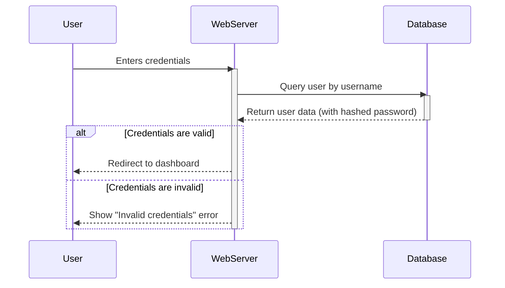
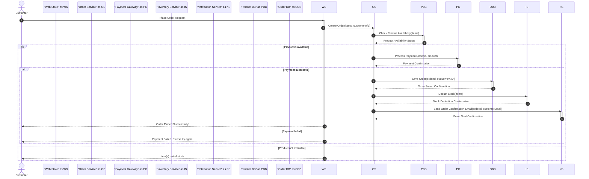
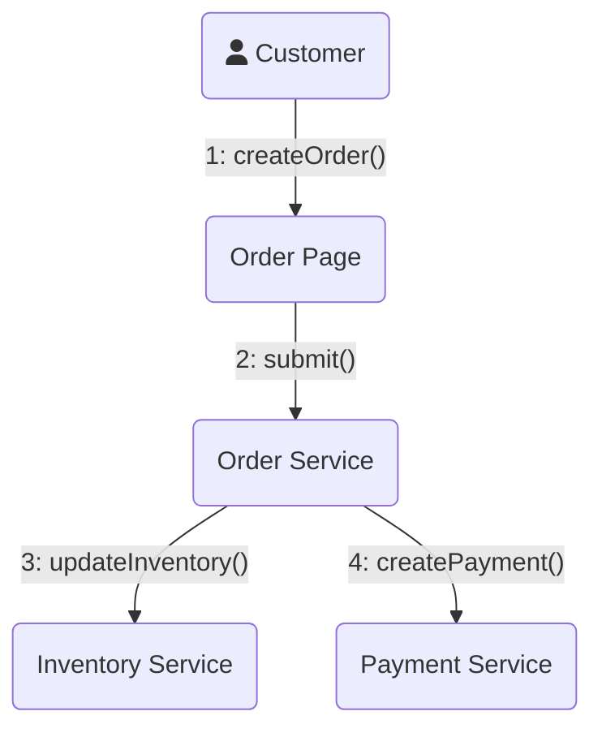
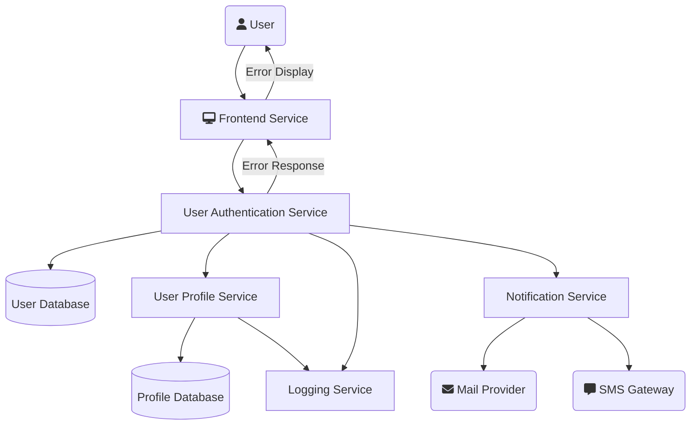

# Interaction Modeling

Interaction models describe how different parts of a system interact with each other and with external actors to accomplish a task. They are dynamic models that show the flow of control and data between objects or components. These models are essential for understanding the runtime behavior of a system.

## Sequence Diagrams

Sequence diagrams are a popular type of interaction diagram because they clearly show the sequence of messages exchanged between actors and objects over time. The vertical dimension represents time, and the horizontal dimension represents the different objects or actors.

### Key Components

-   **Lifeline**: A vertical dashed line that represents an individual participant (object or actor) in the interaction.
-   **Activation Box**: A thin rectangle on a lifeline indicating the period during which the participant is active (e.g., executing a method).
-   **Message**: An arrow from one lifeline to another, representing a communication. Can be synchronous (`->>`) or asynchronous (`->`).
-   **Reply Message**: A dashed arrow showing the return of a message.
-   **Fragments**: Notations like `alt` (alternatives), `opt` (optional), and `loop` can be used to model complex logic.

### Example: User Authentication

This diagram shows the sequence of events when a user tries to log in.

### Advanced Example: E-commerce Order Processing

This complex sequence diagram illustrates the processing of an order in an e-commerce system, including payment, inventory update, and notification. It uses `alt`, `opt`, and `loop` fragments.

## Communication Diagrams

Communication diagrams (formerly known as Collaboration diagrams in UML 1.x) also show interactions between objects, but they emphasize the relationships and links between participants rather than the time sequence. They are useful for visualizing the communication paths between objects.

In Mermaid.js, there isn't a dedicated "Communication Diagram." However, a `graph` or `flowchart` can be used effectively to represent the same concepts.

### Key Components

-   **Participant**: A node representing an object or actor.
-   **Link**: A line connecting two participants, indicating that they can interact.
-   **Message**: A labeled arrow along a link showing the direction of the message. Messages are numbered to indicate their order.

### Example: Processing an Order

This diagram shows the objects involved in processing a customer order and the messages passed between them.

### Advanced Example: Microservice-based User Registration

This example models the static interaction points in a user registration process within a microservice architecture, emphasizing communication channels.

