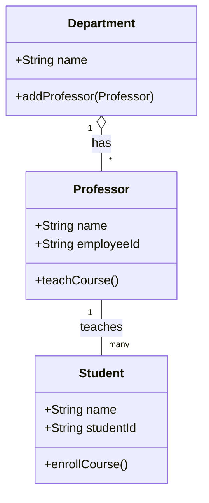
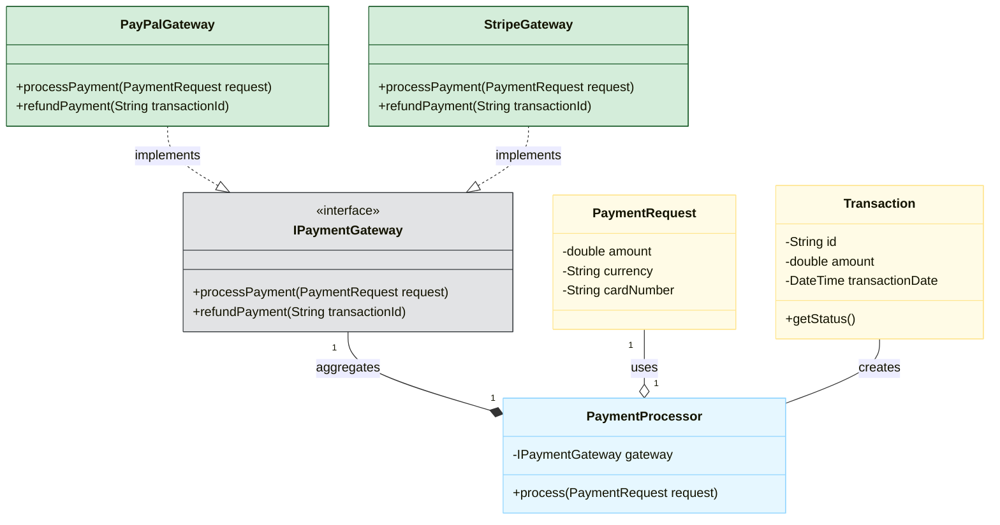
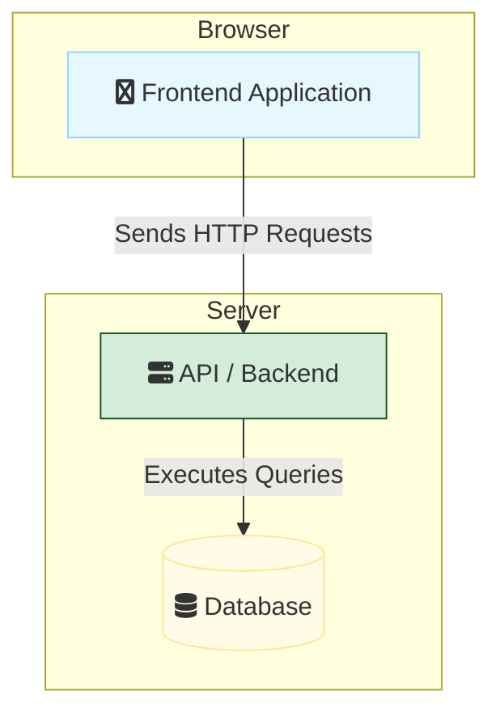
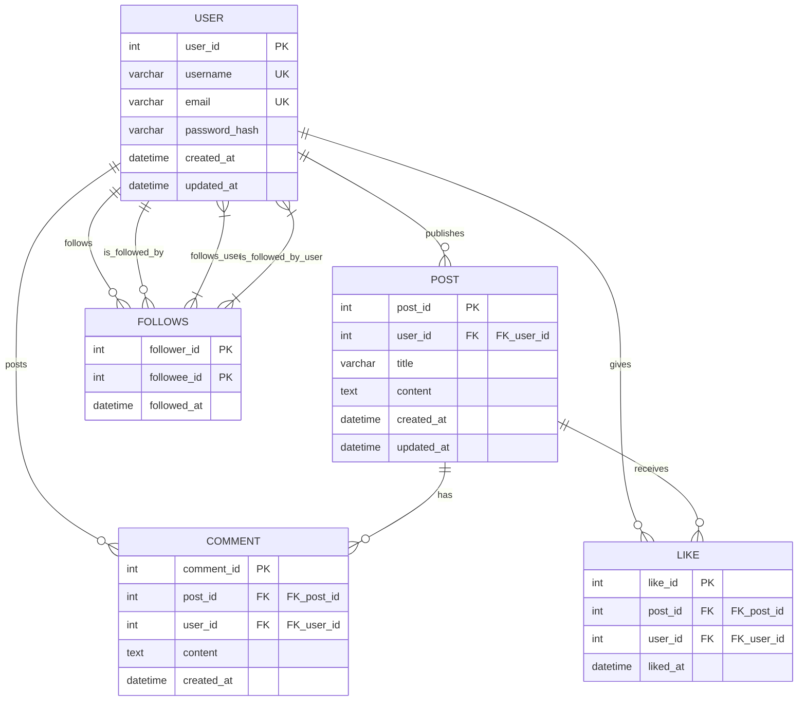

# Structural Modeling

Structural models represent the static structure of a system. They show the components of the system and the relationships between them, without concern for their dynamic, time-based behavior. These diagrams are like architectural blueprints. They are essential for designing the architecture, understanding its components, and communicating the design to developers.

## Class Diagrams

Class diagrams are the main building block of any object-oriented solution. They describe the structure of a system by showing the system's classes, their attributes, operations (or methods), and the relationships between objects.

### Key Relationships

-   **Association**: A general relationship between classes (`--`).
-   **Aggregation**: A "has-a" relationship, where one class contains another, but the contained class can exist independently (`o--`).
-   **Composition**: A strong "has-a" relationship, where the contained class cannot exist without the container (`*--`).
-   **Inheritance (Generalization)**: An "is-a" relationship, where one class inherits from another (`<|--`).

### Example: University System

This diagram models classes for a university, showing relationships between `Department`, `Professor`, and `Student`.



### Advanced Example: Payment Processing System

This class diagram illustrates a simplified payment processing system, showcasing inheritance, composition, and interface implementation.



## Component Diagrams

Component diagrams are used to visualize the physical components of a system, such as libraries, files, and executables, and the relationships (dependencies) between them. They provide a high-level view of the system's architecture from a module or component perspective.

### Key Components

-   **Component**: A modular part of the system, represented by a rectangle with a component icon.
-   **Provided Interface**: An interface that a component exposes to other components.
-   **Required Interface**: An interface that a component needs from another component.
-   **Dependency**: A relationship showing that one component depends on another.

### Example: Web Application Architecture

This diagram shows the high-level components of a typical web application.


### Advanced Example: Microservices E-commerce System

This diagram illustrates a microservice-based e-commerce platform, highlighting interactions between different services and their dependencies.

```mermaid
graph TD
    subgraph Client Applications
        MobileApp[fa:fa-mobile Mobile App]
        WebApp[fa:fa-globe Web App]
    end

    subgraph Microservices Layer
        direction LR
        AuthService(Authentication Service)
        ProductService(Product Catalog Service)
        OrderService(Order Management Service)
        PaymentService(Payment Gateway Service)
        NotificationService(Notification Service)
    end

    subgraph Data Stores
        AuthDB[(Auth Database)]
        ProductDB[(Product Database)]
        OrderDB[(Order Database)]
        PaymentGatewayAPI[External Payment Gateway API]
        EmailSender[External Email Sender]
    end

    MobileApp -- "Authenticate" --> AuthService
    WebApp -- "Authenticate" --> AuthService
    
    MobileApp -- "Browse Products" --> ProductService
    WebApp -- "Browse Products" --> ProductService
    
    MobileApp -- "Place Orders" --> OrderService
    WebApp -- "Place Orders" --> OrderService
    
    AuthService <--> AuthDB
    ProductService <--> ProductDB
    OrderService <--> OrderDB
    
    OrderService -- "Initiates Payment" --> PaymentService
    PaymentService -- "Processes via" --> PaymentGatewayAPI
	PaymentService -- "Updates Payment Status" --> OrderDB
    
	OrderService -- "Confirm Order" --> NotificationService
    NotificationService -- "Via" --> EmailSender


    style AuthService fill:#e6f7ff,stroke:#91d5ff
    style ProductService fill:#e6f7ff,stroke:#91d5ff
    style OrderService fill:#e6f7ff,stroke:#91d5ff
    style PaymentService fill:#e6f7ff,stroke:#91d5ff
    style NotificationService fill:#e6f7ff,stroke:#91d5ff
    style MobileApp fill:#d4edda,stroke:#155724
    style WebApp fill:#d4edda,stroke:#155724
    style AuthDB fill:#fffbe6,stroke:#ffe58f
    style ProductDB fill:#fffbe6,stroke:#ffe58f
    style OrderDB fill:#fffbe6,stroke:#ffe58f
    style PaymentGatewayAPI fill:#e2e3e5,stroke:#383d41
    style EmailSender fill:#e2e3e5,stroke:#383d41
``````


## Entity-Relationship Diagrams (ERDs)

Entity-Relationship Diagrams (ERDs) are used to model the structure of a database. They show the entities (tables), their attributes (columns), and the relationships between them.

Mermaid.js provides a specific syntax for creating ERDs that is clear and easy to read.

### Key Relationships

-   **One-to-One**: `||--||`
-   **One-to-Many**: `||--|{`
-   **Many-to-Many**: `}|--|{` (often resolved with a linking table)
-   **Identifying vs. Non-identifying**: A solid line for identifying relationships (the child's key depends on the parent's) and a dashed line for non-identifying relationships.

### Example: Blogging Platform Database

This ERD models the database for a simple blog with users, posts, and comments.

```mermaid
erDiagram
    USER ||--|{ POST : "writes"
    POST ||--|{ COMMENT : "has"
    USER ||--|{ COMMENT : "makes"

    USER {
        int id PK
        varchar(255) username
        varchar(255) email
        datetime created_at
    }

    POST {
        int id PK
        int user_id FK
        varchar(255) title
        text content
        datetime created_at
    }

    COMMENT {
        int id PK
        int post_id FK
        int user_id FK
        text content
        datetime created_at
    }
```

### Advanced Example: Social Media Platform

This ERD models a more complex social media platform with users, posts, comments, likes, and followers, including many-to-many relationships and self-referencing tables.


